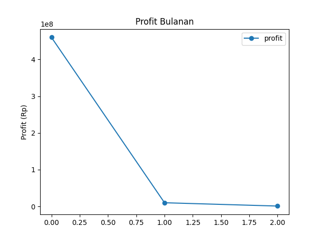

# Proyek Data Engineer

- Hari 2: Analisis Data Penjualan

## Tujuan

- Gabungkan dataset penjualan + produk
- Analisis tren penjualan bulanan
- Visualisasi

## Tools & Dataset

- **Tools**: Python (Pandas)
- **Dataset**:
  - `data_penjualan_clean.csv` (hasil Hari 1)
  - `data_produk.csv` (dataset baru)

## Analisis Utama

### 1. Gabungkan Dataset

```python
import pandas as pd

data_penjualan = pd.read_csv('data_penjualan_clean.csv')
data_produk = pd.read_csv('data_produk.csv')

data_merge = pd.merge(data_penjualan, data_produk, on='produk', how='left')
data_merge['profit'] = data_merge['total_harga'] - (data_merge['harga_beli']*data_merge['quantity'])
```

### 2. Produk Terlaris

```python
produk_terlaris = data.groupby('produk')['quantity'].sum().sort_values(ascending=False)
```


### 3. Profit Bulanan

```python
profit_bulanan = data.groupby('bulan')['profit'].sum()
```



### 4. Visualisasi

- Produk terlaris :

```python
produk_terlaris.plot(kind='bar', title='Produk Terlaris')
plt.ylabel('Jumlah Terjual')
plt.savefig('produk_terlaris.png')
```

- Profit Bulanan :

```python
profit_bulanan.plot(kind='line', marker='o', title='Profit Bulanan')
plt.ylabel('Profit (Rp)')
plt.savefig('profit_bulanan.png')
```
